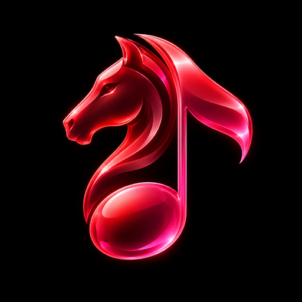
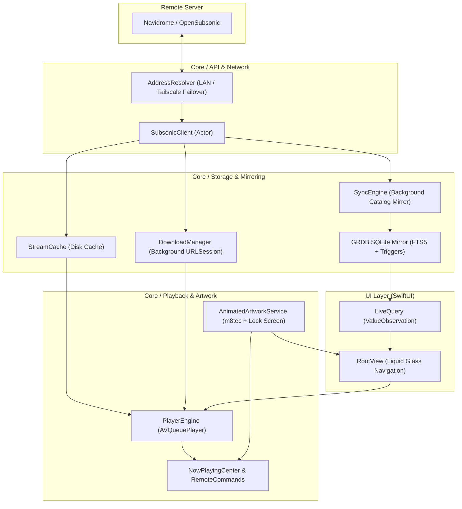

<p align="center">
  
</p>

<h1 align="center">Knight Music</h1>

<p align="center">
  <strong>A native iOS &amp; iPadOS client for Navidrome, built with Apple's Liquid Glass.</strong>
</p>

<p align="center">
  <a href="https://github.com/KNIGHTABDO/knight-music/actions/workflows/ios.yml">
    
  </a>
  <a href="https://developer.apple.com/ios/">
    
  </a>
  <a href="https://swift.org/">
    
  </a>
  <a href="https://developer.apple.com/xcode/swiftui/">
    
  </a>
  <a href="https://www.navidrome.org/">
    
  </a>
  <a href="LICENSE">
    
  </a>
</p>

---

Knight Music is an open-source, native client for [Navidrome](https://www.navidrome.org/) and OpenSubsonic personal music streaming servers. Designed around Apple's modern Liquid Glass paradigm on iOS and iPadOS 26, it pairs fluid animations, deep system integrations, and animated Apple Music artwork with an uncompromising offline-first architecture.

## Screenshots

<table>
  <tr>
    <th colspan="3">iPadOS</th>
  </tr>
  <tr>
    <td align="center" valign="top" width="33%">
      <br />
      <sub><b>Home &amp; Sidebar</b></sub>
    </td>
    <td align="center" valign="top" width="33%">
      <br />
      <sub><b>Full Player &amp; Queue</b></sub>
    </td>
    <td align="center" valign="top" width="33%">
      <br />
      <sub><b>Album Detail</b></sub>
    </td>
  </tr>
  <tr>
    <th colspan="3">iOS</th>
  </tr>
  <tr>
    <td align="center" valign="top" width="33%">
      <br />
      <sub><b>Home View</b></sub>
    </td>
    <td align="center" valign="top" width="33%">
      <br />
      <sub><b>Now Playing</b></sub>
    </td>
    <td align="center" valign="top" width="33%">
      <br />
      <sub><b>Synced Lyrics</b></sub>
    </td>
  </tr>
</table>

## Features

- **Liquid Glass design**: Native iOS 26 interface leveraging `.tabViewStyle(.sidebarAdaptable)` with customizable sidebar sections (`tabViewCustomization`) on iPad and floating glass navigation on iPhone. Features a dedicated glass mini player bottom accessory (`tabViewBottomAccessory`), interactive capsule and circular controls grouped in `GlassEffectContainer`, and seamless zoom transitions (`.navigationTransition(.zoom(sourceID:in:))`) from mini player artwork directly into the full-screen player.
- **Library**: Complete catalog navigation and collection management. Artists browse with an A–Z alphabet scrubber index; albums sort by title, artist, release year, date added, play count, or recently played; song lists support quick search and sorting; full playlist management allows creating, renaming, deleting, reordering, and modifying tracks; dedicated sections for genres, favorites (artists, albums, songs), and live internet radio stations; plus dynamic smart shelves for Recently Played, Recently Added, Frequently Played, and Random selections.
- **Player**: Audiophile-grade playback core built on `AVQueuePlayer`. Provides gapless playback with advance look-ahead item preparation, dynamic ambient palette backgrounds extracted from artwork (`ArtworkPalette`), time-synchronized lyrics with tap-to-seek and auto-scroll, comprehensive queue manipulation (drag reordering, swipe deletion, play next/later), customizable sleep timer with gentle audio fade-out and end-of-song pause, AirPlay route picker integration, ReplayGain volume normalization (track and album modes with peak clamping), and synced star and 5-star ratings.
- **Animated artwork**: High-fidelity album presentation featuring Apple Music animated artwork fetched via `artwork.m8tec.top`, supporting both square (1:1) video for iPad and full-bleed tall (3:4) video for iPhone portrait. Full integration with the iOS 26 lock screen via `MPMediaItemAnimatedArtwork` (`MPNowPlayingInfoProperty1x1AnimatedArtwork` and `MPNowPlayingInfoProperty3x4AnimatedArtwork`). Automatically converts server animated WebP and GIF covers to looping H.264 MP4 videos on device with `AVAssetWriter`, with unmetered Wi-Fi gating to preserve mobile data.
- **Offline-first**: Zero-latency local SQLite mirror driven by GRDB 7, allowing immediate UI rendering without awaiting network responses. High-performance full-text search powered by SQLite FTS5 using `unicode61 remove_diacritics 2` tokenization for Arabic and Latin scripts. Background catalog synchronization scheduled with `BGTaskScheduler` (`BGAppRefreshTask`), automatic stream caching that saves played streams up to a configurable disk quota, resilient background downloads handled by a background `URLSession` that survives app termination, and automatic/manual offline operation modes.
- **Server**: Multi-account management with instant server switching. Multiple addresses per server with automatic, prioritized failover (e.g. prioritizing local LAN addresses when connected at home, seamlessly falling back to Tailscale or remote domain URLs via concurrent health checks). Built-in Subsonic scrobbler with offline buffering and reconnect submission, bi-directional server play queue synchronization, and a server status dashboard with OpenSubsonic extension detection and manual library scan controls (quick and full scans).

## Requirements

- **iOS 26.0+** or **iPadOS 26.0+** (iPhone &amp; iPad)
- **Navidrome** or any server implementing the OpenSubsonic / Subsonic API

## Install (no Mac needed)

Knight Music is distributed as a pre-built, unsigned iOS application (`.ipa`) that can be sideloaded directly on your device without needing a Mac or a paid Apple Developer account.

1. **Download the IPA**: Obtain the latest `KnightMusic.ipa` from [GitHub Releases](https://github.com/KNIGHTABDO/knight-music/releases).
2. **Sideload with SideStore**:
   - Install [SideStore](https://sidestore.io/) on your device using your free Apple ID.
   - Open SideStore, tap `+`, select `KnightMusic.ipa`, and install.
   - SideStore automatically refreshes the 7-day provisioning profile directly on your device over local Wi-Fi / WireGuard loopback—no computer required after initial setup.
3. **Log in**: Launch Knight Music, enter your Navidrome server address (e.g. `https://music.example.com`), username, and password.
4. **Remote Access with Tailscale**: If your Navidrome server runs on your home local network, install [Tailscale](https://tailscale.com/) on both your server and iOS device. In Knight Music's server settings (**Settings → Manage Addresses**), add both your local LAN address (`http://192.168.1.x:4533`) and your Tailscale address (`http://100.x.y.z:4533`). Knight Music will automatically connect over high-speed LAN when at home and seamlessly fail over to Tailscale when you are away.

## Architecture

The application is structured into decoupled core services, local database mirroring, and a pure SwiftUI presentation layer.



### Data Flow

```text
Navidrome API ──► SubsonicClient ──► SyncEngine ──► GRDB SQLite ──► LiveQuery ──► SwiftUI Views
```

- **Offline-First Reactive Queries**: Views observe database records through `LiveQuery`, an `@Observable` wrapper around GRDB's `ValueObservation`. Lists render immediately from local SQLite and update automatically whenever records change.
- **Independent Audio Pipeline**: `PlayerEngine` manages playback using `AVQueuePlayer` and resolves audio sources with prioritized fallback: Local Download → Stream Cache → Live Server Stream.
- **Key Dependencies**:
  - **[GRDB.swift 7](https://github.com/groue/GRDB.swift)**: Robust SQLite toolkit managing the local schema, migrations, FTS5 full-text search tables, and reactive database observation.
  - **[Nuke 12](https://github.com/kean/Nuke) / NukeUI**: High-performance image loading, caching, downsampling, and display pipeline for cover artwork and artist portraits.

## Building

The project uses [XcodeGen](https://github.com/yonaskolb/XcodeGen) to define the project structure declaratively in `project.yml`, ensuring clean git diffs without committing `.xcodeproj` bundles.

### Local Generation

If you have macOS and Xcode 26 installed:

```bash
# Install XcodeGen
brew install xcodegen

# Generate the Xcode project file
xcodegen generate

# Open in Xcode
open KnightMusic.xcodeproj
```

### Continuous Integration (CI)

Because primary development can occur on Linux machines without a local macOS environment, GitHub Actions acts as the compiler gate:

- **Push Gate**: Every push to any branch runs `.github/workflows/ios.yml` on a `macos-26` runner to verify compilation against the iOS Simulator SDK.
- **Release Automation**: Pushing any git tag prefixed with `v*` (e.g. `git tag v0.1.0 && git push origin v0.1.0`) triggers an archive build targeting generic iOS hardware. The workflow packages the application into an unsigned `KnightMusic.ipa` and attaches it to a new GitHub Release.
- **Screenshot Pipeline**: Adding `[shots]` to a commit message, running on `main`, or manually dispatching the workflow with `screens: true` executes `scripts/screens.sh`. The script boots iPhone and iPad simulators, sets the status bar clock to 9:41 AM, runs Knight Music in demo mode (`-KMDemo YES -KMScreen <name>`) across 13 distinct views, captures high-resolution screenshots, and uploads them as the `screens` build artifact.

## Roadmap

The following capabilities are planned for upcoming releases:

- **Hermes AI Agent Integration**: Conversational music curation allowing you to queue tracks, generate contextual playlists, and explore your library through natural language chat.
- **CarPlay**: Native CarPlay interface for safe, streamlined library navigation and playback control while driving.
- **Widgets**: iOS and iPadOS Home Screen and Lock Screen widgets displaying now-playing media, recently played albums, and quick-launch shortcuts.

## Acknowledgements

- **[Navidrome](https://www.navidrome.org/)** — Open-source, high-performance music server and streamer.
- **[OpenSubsonic](https://opensubsonic.io/)** — Community-driven open API standards for personal media servers.
- **[GRDB.swift](https://github.com/groue/GRDB.swift)** — Excellent SQLite database library by Gwendal Roué.
- **[Nuke](https://github.com/kean/Nuke)** — Elegant image loading system by Alexander Grebenyuk.
- **[artwork.m8tec.top](https://artwork.m8tec.top/)** — High-resolution animated cover artwork API for Apple Music albums.
- **[Arpeggi](https://github.com/arpeggi-app)** — Visual and interaction design inspiration.

## License

This project is open-source software licensed under the [MIT License](LICENSE).

Copyright &copy; 2026 KNIGHTABDO.
